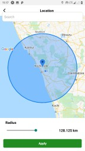
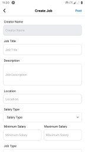

# facebook-jobs
Facebook jobs module built using React Native

<b>Instructions to run the application</b>
* Download the code.
* Install the required packages.
* Run the code.

<b>Screenshots</b>
 

